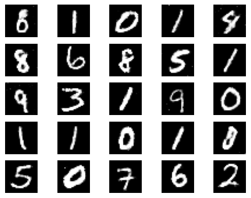
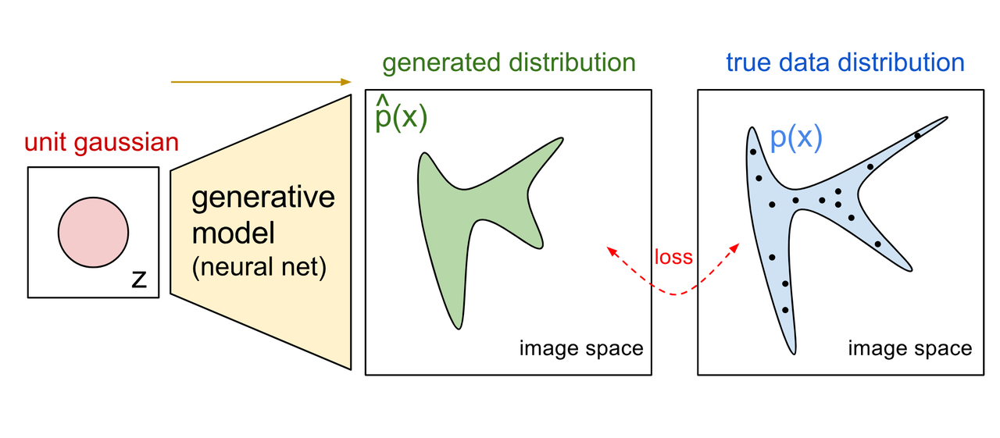
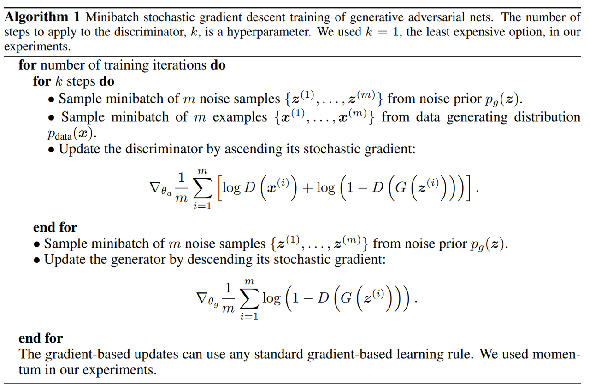
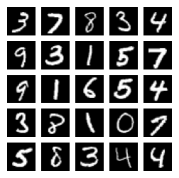
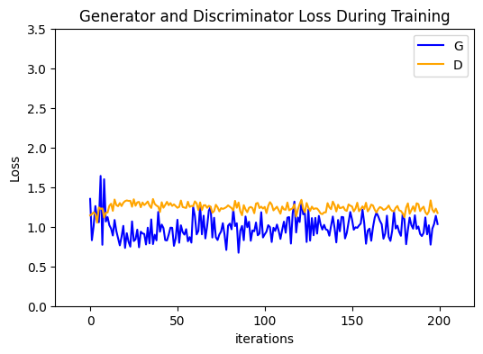
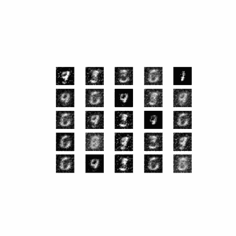
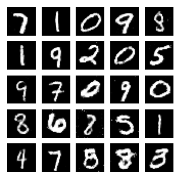

# GANs图像生成

<center></center>

## 什么是GANs  
生成对抗网络（Generative Adversarial Networks，GANs）是一种生成式机器学习框架，它能够学习真实图像数据（或音乐、语音或文本数据）的分布，进而通过模仿真实图像生成能以假乱真的伪造图像数据。GANs最早由深度学习领域专家Ian Goodfellow等人在 2014 年的论文[Generative Adversarial Nets](https://papers.nips.cc/paper/5423-generative-adversarial-nets.pdf)中提出。近年来，GANs一直是一个活跃的研究主题，人工智能领域专家 Yann LeCun 称对抗性训练是机器学习领域“过去 10 年来最有趣的想法”。  
<br>

## GANs框架  
GANs主要由两个不同的模型构成：**生成器**和**判别器**。其中生成器的目标是生成与真实图片数据近似的伪造数据，而判别器的目标是正确区分图像样本是来自真实数据分布还是由生成器生成的伪造数据。在此框架中我们同时训练生成器和判别器，使其相互博弈：生成器不断尝试通过生成越来越好的假图像来骗过判别器，而判别器试图更好地识别出生成的样本。在对抗性训练的过程中，生成器生成逼真图像的能力逐渐变强，同时判别器鉴别真伪的能力也逐渐变强。当生成器生成的数据分布和真实数据分布相同，并且判别器不再能够有效区分真实图片和伪造图片时，训练过程达到平衡。  
<br>

我们利用数学符号更详细地表述以上过程：  
### 生成器

<center></center>

我们记图像空间为 $ \mathbf{X} $ ，图像空间中的任意一个点 $ x\in\mathbf{X} $ 代表一张具体的图像。图像 $ x_1,x_2,...,x_n $ 代表训练集中的样本，它们取自总体为 $ X_{data} $ 的真实数据分布。上图中的蓝色部分表示了分布 $ X_{data} $ ，其中的黑点表示采样自该分布的训练集样本。  
<br>

我们记 $ z $ 是隐空间中取自随机噪声分布 $ Z $ 的样本点（该例中我们选取 $ Z $ 为标准正态分布），我们称之为隐码（latent code），生成器 $ G $ 将隐码 $ z $ 从隐空间映射到图像空间进而生成了一张伪造图像 $ x_g=G(z) $ ，更一般地， $ G $ 将隐空间中的分布 $ Z $ 映射为图像空间中的分布 $ X_g\triangleq G(Z) $ 。  
<br>

我们希望生成器生成的图像能够以假乱真，这意味着我们希望伪造数据的分布 $ X_g $ 能够尽量和真实数据分布 $ X_{data} $ 接近甚至是一致。在数学上我们有许多工具（例如KL散度、JS散度等）能够直接衡量两个分布之间的差异，但这些工具的优化问题往往比较棘手。而GANs通过判别器间接衡量两者差异，通过判别器和生成器的交替训练来优化这一问题。  
<br>

### 判别器

延续上面的记号，记图像空间 $ \mathbf{X} $ 中的任意一点 $ x\in\mathbf{X} $ 代表一张具体的图像。 $ D $ 是判定图像真假的判别器模型，通过计算 $ D(x) $ ，模型将输出一个取值范围为 $ [0,1] $ 的标量，该标量表示样本 $ \bold{x} $ 取自真实数据分布而非生成器生成的概率。直观来说，判别器接受真实图片输入后应当尽量输出接近1的值，而输入生成器生成的伪造图片时则输出尽量接近于0的值，这与我们常见的二元分类任务别无二致。  
<br>

### 训练

在二元分类任务中，我们常常采用二元交叉熵（Binary Cross Entropy，BCE）作为任务的损失函数。当 $ x $ 为正例时，BCE以 $ -log(D(x)) $ 作为分类模型 $ D $ 的损失；当 $ x $ 为负例时，损失为 $ -log(1-D(x)) $ ，在本教程的生成任务中，上述两项分别对应 $ -\mathbb{E}_{x\sim X_{data}}[log(D(x))] $ 和 $ -\mathbb{E}_{z\sim Z}[log(1-D(G(z)))] $ ，因此对于给定的生成器 $ G $ 和判别器 $ D $ ，判别器的损失函数为

$$\begin{equation}loss(D,G)=-\mathbb{E}_{x\sim X_{data}}[log(D(x))]-\mathbb{E}_{z\sim Z}[log(1-D(G(z)))].\end{equation}$$  

在判别器的训练过程中，我们调整判别器模型 $ D $ 的参数以最小化该损失函数，进而优化模型使 $ D $ 能够更好地分辨图像真。  
<br>

而对于生成器而言，其目标是生成更逼真的图片来以假乱真地瞒过 $ D $ 的判断，因此在生成器模型的训练过程中，我们调整 $ G $ 的参数以最大化损失函数（1），更具体地说，是最大化其中与 $ G $ 相关的 $ -\mathbb{E}_{z\sim Z}[log(1-D(G(z)))] $ 一项。  
<br>

我们交替进行判别器和生成器的训练，令两者在对抗中学习，从而使生成器学会模拟生成真实数据的分布。为与原论文记号保持一致，我们记 $ V(D,G)=-loss(D,G) $ ，则上述任务可以表示为
$$\begin{equation}\mathop{min}\limits_{G}\mathop{max}\limits_{D}V(D,G)=\mathbb{E}_{x\sim X_{data}}[log(D(x))]+\mathbb{E}_{z\sim Z}[log(1-D(G(z)))].\end{equation}$$  

原论文给出了训练过程的伪代码如下：

<center></center>

## MindSpore实践  

本案例将使用MNIST手写数字数据集作为真实数据分布来训练一个生成式对抗网络，我们使用GAN模拟生成手写数字图片。  

```python
import os
import time
import cv2
import numpy as np
import matplotlib.pyplot as plt
import matplotlib.animation as animation
from download import download

import mindspore as ms
from mindspore import Tensor, nn, ops, save_checkpoint
from mindspore.common import dtype
import mindspore.dataset as ds
```

我们设定一些必要的参数：
```python
batch_size = 128    # 用于训练的训练集批量大小
total_epoch = 200   # 训练周期数
latent_size = 100   # 隐码z的长度
img_size = 28       # 训练图像长（宽）
lr = 0.0002         # 优化器（Adam）参数learning_rate
beta1 = 0.5         # 优化器（Adam）参数beta1
beta2 = 0.999       # 优化器（Adam）参数beta2
```

<br>

### 数据集

[MNIST手写数字数据集](http://yann.lecun.com/exdb/mnist/)是NIST数据集的子集，共有70000张手写数字图片，包含60000张训练样本和10000张测试样本，样本为1*28*28单通道图片，以二进制文件形式存储。  

**数据集下载**  

我们使用`download`包提供的接口下载数据集，并将下载后的数据集自动解压到当前目录下。

```python
# 数据集下载
download_url = "https://mindspore-website.obs.cn-north-4.myhuaweicloud.com/notebook/datasets/MNIST_Data.zip"
download(download_url, ".", kind="zip", replace=True)
```

下载并解压后，数据集的目录格式如下：  

```
./MNIST_Data/
├─ train
│ ├─ train-images-idx3-ubyte
│ └─ train-labels-idx1-ubyte
└─ test
   ├─ t10k-images-idx3-ubyte
   └─ t10k-labels-idx1-ubyte
```

<br>

**读取数据集**

使用`mindspore.dataset.MnistDatase`接口，读取和解析MNIST数据集的源文件构建数据集。我们将MNIST的训练集和验证集整体合并为一个集合，作为GAN模型的训练集使用。

```python
# 读取数据，并将MNIST训练集和验证集合并为一个整体
train_dataset = ds.MnistDataset(dataset_dir='./MNIST_Data/train')
test_dataset = ds.MnistDataset(dataset_dir='./MNIST_Data/test')
mnist_ds = train_dataset.concat(test_dataset)

# 设置训练集的批量大小
mnist_ds = mnist_ds.batch(batch_size=batch_size, drop_remainder=True)

# 打印训练集批次总量
iter_size = mnist_ds.get_dataset_size()
print('Iter size: %d' % iter_size)
```

**数据集可视化** 

使用`matplotlib`包可视化部分训练数据。这里我们使用`mindspore.dataset.Dataset.create_dict_iterator()`利用数据集生成字典迭代器读取数据。

```python
data_iter = next(mnist_ds.create_dict_iterator(output_numpy=True))
figure = plt.figure(figsize=(3, 3))
# 可视化5行5列共25个训练图像样本
cols, rows = 5, 5
for idx in range(cols * rows):
    image = data_iter['image'][idx]
    figure.add_subplot(rows, cols, idx + 1)
    plt.axis("off")
    plt.imshow(image.squeeze(), cmap="gray")
plt.show()
```

<center></center>

<br>

### 模型实现

**生成器**

生成器 $ G $ 将隐空间中的向量 $ z $ 映射到图像空间，从而生成伪造的图片。由于我们的训练数据是MNIST数据集中的手写图像，因此将 $ z $ 映射到图像空间意味着最终生成一个与训练图像大小（1x28x28）相同的灰度图。在实践中，我们通常使用神经网络作为生成器，关于生成器模型结构的具体设计是GANs研究的一个重要方向。  
<br>

本教程中我们沿用原始论文中的设定，尝试使用多层感知机（Multilayer Perceptron，MLP）作为生成器模型，模型接受维度为`latent_dim`一维向量 $ z $ 为输入，输出大小为1x28x28的图像数据。该模型由五层全连接层`mindspore.nn.Dense()`构成，除第一层和最后一层以外都后接`mindspore.nn.BatchNorm1d()`做批归一化，除最后一层以外都后接`mindspore.nn.ReLU()`作为激活函数，最后一层后接mindspore.nn.Tanh()将生成图像的像素值归一化到 $ [-1,1] $ 范围内。

```python
# 生成器模型构造
class Generator(nn.Cell):
    def __init__(self, latent_size, auto_prefix=True):
        super(Generator, self).__init__(auto_prefix=auto_prefix)
        self.model = nn.SequentialCell()
        # [N, 100] -> [N, 128]
        # 输入一个100维的0～1之间的高斯分布，然后通过第一层线性变换将其映射到256维
        self.model.append(nn.Dense(latent_size, 128))
        self.model.append(nn.ReLU())
        # [N, 128] -> [N, 256]
        self.model.append(nn.Dense(128, 256))
        self.model.append(nn.BatchNorm1d(256))
        self.model.append(nn.ReLU())
        # [N, 256] -> [N, 512]
        self.model.append(nn.Dense(256, 512))
        self.model.append(nn.BatchNorm1d(512))
        self.model.append(nn.ReLU())
        # [N, 512] -> [N, 1024]
        self.model.append(nn.Dense(512, 1024))
        self.model.append(nn.BatchNorm1d(1024))
        self.model.append(nn.ReLU())
        # [N, 1024] -> [N, 784]
        # 经过线性变换将其变成784维
        self.model.append(nn.Dense(1024, img_size * img_size))
        # 经过Tanh激活函数是希望生成的假的图片数据分布能够在-1～1之间
        self.model.append(nn.Tanh())

    def construct(self, noise):
        img = self.model(noise)
        return ops.reshape(img, (-1, 1, 28, 28))

# 创建生成器实例
# 注意实例化生成器之后需要修改参数的名称，否则静态图模式下会报错
net_g = Generator(latent_size)
net_g.update_parameters_name('generator')
```

**判别器** 

判别器 $ D $ 是一个二元分类网络， $ D $ 接受图像数据作为输入，并输出该图像取自真实数据分布的概率。事实上这种二元分类模型在过往发展中有过许多相关研究，并且仍在不断采纳新的计算机视觉判别模型推陈出新。  
<br>

本教程中我们沿用原始论文的设定，仍尝试使用多层感知机作为判别器模型。模型输入为大小1x28x28的图像数据，输出 $ [0,1] $ 之间的标量。模型由三层全连接层`mindspore.nn.Dense()`构成，除最后一层以外都后接`mindspore.nn.ReLU()`作为激活函数，最后一层后接`mindspore.nn.Sigmoid()`将输出值规范到 $ [0,1] $ 之间。

```python
# 判别器模型构造
class Discriminator(nn.Cell):
   def __init__(self, auto_prefix=True):
       super().__init__(auto_prefix=auto_prefix)
       self.model = nn.SequentialCell()
       # [N, 784] -> [N, 512]
       self.model.append(nn.Dense(img_size * img_size, 512))  # 输入特征数为784，输出为512
       self.model.append(nn.LeakyReLU())  # 默认斜率为0.2的非线性映射激活函数
       # [N, 512] -> [N, 256]
       self.model.append(nn.Dense(512, 256))  # 进行一个线性映射
       self.model.append(nn.LeakyReLU())
       # [N, 256] -> [N, 1]
       self.model.append(nn.Dense(256, 1))
       self.model.append(nn.Sigmoid())  # 二分类激活函数，将实数映射到[0,1]

   def construct(self, x):
       x_flat = ops.reshape(x, (-1, img_size * img_size))
       return self.model(x_flat)

# 创建判别器实例
net_d = Discriminator()
net_d.update_parameters_name('discriminator')
```

**损失函数和优化器**

我们利用二元交叉熵`mindspore.nn.BCELoss()`构造模型训练过程中的损失函数。创建生成器和判别器的实例后，我们为两者分别为创建一个`mindspore.nn.Adam()`优化器，分别更新两者参数。  
<br>

为了跟踪生成器的学习进度，我们生成一组采样自标准正态分布的固定隐码`fixed_noise`，在训练的过程中的每轮迭代结束后，将`fixed_noise`输入到生成器中，通过固定隐码所生成的图像效果来评估生成器的好坏。 
```python
# 损失函数
adversarial_loss = nn.BCELoss(reduction='mean')

# 优化器
optimizer_d = nn.Adam(net_d.trainable_params(), learning_rate=lr, beta1=beta1, beta2=beta2)
optimizer_g = nn.Adam(net_g.trainable_params(), learning_rate=lr, beta1=beta1, beta2=beta2)
optimizer_g.update_parameters_name('optim_g')
optimizer_d.update_parameters_name('optim_d')

# 固定隐码
fixed_noise = Tensor(np.random.normal(size=(25, latent_size)), dtype.float32)
```

**训练**

接下来我们进入GAN的训练过程。在训练过程中，我们交替地更新判别器 $ D $ 和生成器 $ G $ 的参数。  
<br>

对于判别器 $ D $ ，我们遵循[ganhacks](https://github.com/soumith/ganhacks)总结出的训练技巧，将真实图像和伪造图像分别构造成两个全真和全伪两个批次，分别计算两个批次的损失函数，并将其相加从而计算出 $ D $ 总的损失函数。  
<br>

对于生成器 $ G $ ，我们参照作者在[NIPS 2016](https://arxiv.org/pdf/1701.00160.pdf)上提出的改进方案，将优化目标从 $ \mathop{min}\limits_{G}\mathbb{E}_{z\sim Z}[log(1-D(G(z)))] $ 修改为 $ \mathop{max}\limits_{G}\mathbb{E}_{z\sim Z}[log(D(G(z)))] $ 从而缓解训练中的梯度消失问题。
```python
checkpoints_path = "./result/checkpoints"  # 结果保存路径
image_path = "./result/images"  # 测试结果保存路径

# 生成器计算损失过程
def generator_forward(test_noises):
    fake_data = net_g(test_noises)
    fake_out = net_d(fake_data)
    loss_g = adversarial_loss(fake_out, ops.ones_like(fake_out))
    return loss_g

# 判别器计算损失过程
def discriminator_forward(real_data, test_noises):
    # 全伪批次的损失
    fake_data = net_g(test_noises)
    fake_out = net_d(fake_data)
    fake_loss = adversarial_loss(fake_out, ops.zeros_like(fake_out))
    # 全真批次的损失
    real_out = net_d(real_data)
    real_loss = adversarial_loss(real_out, ops.ones_like(real_out))
    # 总损失
    loss_d = real_loss + fake_loss
    return loss_d

# 梯度方法
grad_g = ms.value_and_grad(generator_forward, None, net_g.trainable_params())
grad_d = ms.value_and_grad(discriminator_forward, None, net_d.trainable_params())

# 模型训练
def train_step(real_data, latent_code):
    # 计算判别器的损失和梯度，并优化判别器
    loss_d, grads_d = grad_d(real_data, latent_code)
    optimizer_d(grads_d)
    
    # 计算生成器的损失和梯度，并优化生成器
    loss_g, grads_g = grad_g(latent_code)
    optimizer_g(grads_g)

    return loss_d, loss_g

# 保存生成的test图像
def save_imgs(gen_imgs, idx):
    for i in range(gen_imgs.shape[0]):
        plt.subplot(5, 5, i + 1)
        plt.imshow(gen_imgs[i, 0, :, :], cmap="gray")
        plt.axis("off")
    plt.savefig(image_path + "/test_{}.png".format(idx))

# 设置参数保存路径
os.makedirs(checkpoints_path, exist_ok=True)
# 设置中间过程生成图片保存路径
os.makedirs(image_path, exist_ok=True)

# 储存生成器和判别器loss
losses_g, losses_d = [], []

# 模型训练
for epoch in range(total_epoch):
    start = time.time()
    net_g.set_train(True)
    net_d.set_train(True)
    for (iter, (image, _)) in enumerate(mnist_ds.create_tuple_iterator()):
        start1 = time.time()

        image = (image - 127.5) / 127.5  # [0, 255] -> [-1, 1]
        image = image.transpose(0, 3, 1, 2) # NHWC -> NCHW

        latent_code = np.random.normal(size=(image.shape[0], latent_size))
        latent_code = Tensor(latent_code, dtype.float32)

        d_loss, g_loss = train_step(image, latent_code)
        end1 = time.time()
        if iter % 10 == 0:
            print(f"Epoch:[{int(epoch):>3d}/{int(total_epoch):>3d}], "
                  f"step:[{int(iter):>4d}/{int(iter_size):>4d}], "
                  f"loss_d:{d_loss.asnumpy():>4f} , "
                  f"loss_g:{g_loss.asnumpy():>4f} , "
                  f"time:{(end1 - start1):>3f}s, "
                  f"lr:{lr:>6f}")

    end = time.time()
    print("time of epoch {} is {:.2f}s".format(epoch + 1, end - start))

    losses_d.append(d_loss.asnumpy())
    losses_g.append(g_loss.asnumpy())

    # 每个epoch结束后，使用生成器生成一组图片
    net_g.set_train(False)
    gen_imgs = net_g(fixed_noise)
    save_imgs(gen_imgs.asnumpy(), epoch)

    # 根据epoch保存模型权重文件
    if epoch % 1 == 0:
        save_checkpoint(net_g, checkpoints_path + "/Generator%d.ckpt" % (epoch))
        save_checkpoint(net_d, checkpoints_path + "/Discriminator%d.ckpt" % (epoch))
```
```
Epoch:[  0/200], step:[   0/ 546], loss_d:1.378109 , loss_g:0.707805 , time:12.028127s, lr:0.000200
Epoch:[  0/200], step:[  10/ 546], loss_d:1.126888 , loss_g:0.642316 , time:0.013258s, lr:0.000200
Epoch:[  0/200], step:[  20/ 546], loss_d:1.345392 , loss_g:0.648637 , time:0.013097s, lr:0.000200
...
Epoch:[ 99/200], step:[ 520/ 546], loss_d:1.278806 , loss_g:0.788421 , time:0.016179s, lr:0.000200
Epoch:[ 99/200], step:[ 530/ 546], loss_d:1.225174 , loss_g:0.919487 , time:0.016286s, lr:0.000200
Epoch:[ 99/200], step:[ 540/ 546], loss_d:1.313319 , loss_g:0.772294 , time:0.016618s, lr:0.000200
time of epoch 100 is 8.90s
Epoch:[100/200], step:[   0/ 546], loss_d:1.218305 , loss_g:0.969774 , time:0.022327s, lr:0.000200
Epoch:[100/200], step:[  10/ 546], loss_d:1.207346 , loss_g:0.950892 , time:0.015048s, lr:0.000200
Epoch:[100/200], step:[  20/ 546], loss_d:1.194068 , loss_g:1.050510 , time:0.015720s, lr:0.000200
...
Epoch:[199/200], step:[ 520/ 546], loss_d:1.301628 , loss_g:0.941630 , time:0.016914s, lr:0.000200
Epoch:[199/200], step:[ 530/ 546], loss_d:1.152424 , loss_g:1.062031 , time:0.016409s, lr:0.000200
Epoch:[199/200], step:[ 540/ 546], loss_d:1.176056 , loss_g:0.905459 , time:0.020880s, lr:0.000200
time of epoch 200 is 10.22s
```

## 训练结果

我们通过matplotlib展示 $ D $ 和 $ G $ 随迭代轮次的变化情况：
```python
plt.figure(figsize=(6, 4))
plt.title("Generator and Discriminator Loss During Training")
plt.plot(losses_g, label="G", color='blue')
plt.plot(losses_d, label="D", color='orange')
plt.xlim(-20, 220)
plt.ylim(0, 3.5)
plt.xlabel("iterations")
plt.ylabel("Loss")
plt.legend()
plt.show()
```

<center></center>


利用之前生成的固定隐码`fixed_noise`，观察不同迭代轮次生成器生成的图像`G(fixed_noise)`质量，保存为gif文件：
```python
image_list = []
for i in range(total_epoch):
    image_list.append(cv2.imread(image_path + "/test_{}.png".format(i), cv2.IMREAD_GRAYSCALE))
show_list = []
fig = plt.figure(dpi=70)
for epoch in range(0, len(image_list), 5):
    plt.axis("off")
    show_list.append([plt.imshow(image_list[epoch], cmap='gray')])

ani = animation.ArtistAnimation(fig, show_list, interval=1000, repeat_delay=1000, blit=True)
ani.save('train_test.gif', writer='pillow', fps=1)
```

<center></center>

**模型推理** 

下面我们通过加载生成器网络模型参数文件来生成图像并观察图像质量：
```python
# 加载训练结果
test_ckpt = './result/checkpoints/Generator199.ckpt'
parameter = ms.load_checkpoint(test_ckpt)
ms.load_param_into_net(net_g, parameter)
# 模型生成结果
test_data = Tensor(np.random.normal(0, 1, (25, 100)).astype(np.float32))
images = net_g(test_data).transpose(0, 2, 3, 1).asnumpy()
# 结果展示
fig = plt.figure(figsize=(3, 3), dpi=120)
for i in range(25):
    fig.add_subplot(5, 5, i + 1)
    plt.axis("off")
    plt.imshow(images[i].squeeze(), cmap="gray")
plt.show()
```

<center></center>

## 后续工作

基于GANs，提出了许多进一步