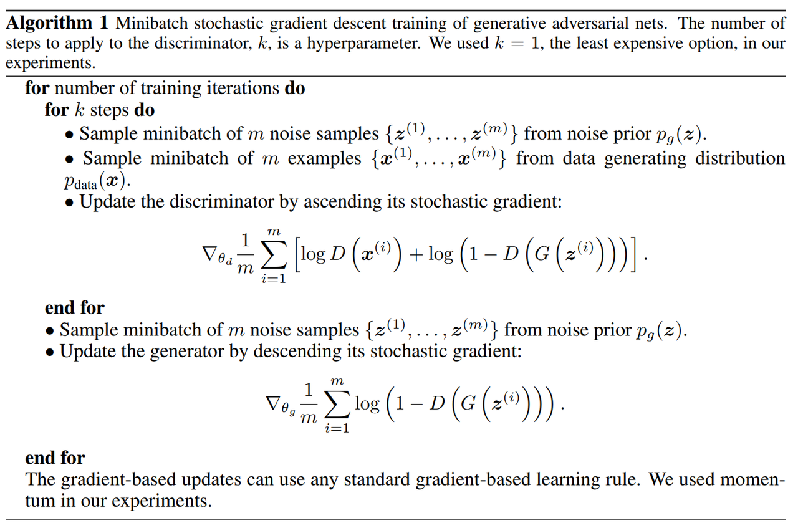
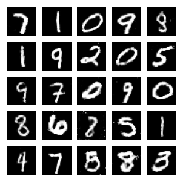

# GANs 

<p align="center"></p>

## What are GANs  

Generative Adversarial Networks (GANs) are a generative machine learning framework capable of learning the distribution of real data (such as images, music, speech, or text data) and subsequently generating counterfeit data that closely mimics real data. GANs were first introduced by Ian Goodfellow, expert in the field of deep learning, and others in their [2014 paper](https://papers.nips.cc/paper/5423-generative-adversarial-nets.pdf). In recent years, GANs have remained a highly active research topic, with Yann LeCun, expert in the field of artificial intelligence, referring to adversarial training as "the most intriguing idea in the past 10 years" in the field of machine learning.

<br>
  

## GANs Framework

GANs are primarily composed of two distinct models: the **generator** and the **discriminator**. The generator's objective is to produce counterfeit data that closely resembles real image data, while the discriminator's goal is to correctly distinguish whether an image sample comes from the real data distribution or is generated by the generator. In this framework, we simultaneously train both the generator and the discriminator, allowing them to engage in a game-like scenario: the generator continually tries to deceive the discriminator by producing increasingly convincing fake images, while the discriminator aims to better identify generated samples. During adversarial training, the generator's ability to generate realistic images gradually improves, and the discriminator's ability to discriminate between real and fake samples also improves. When the data distribution generated by the generator matches the real data distribution, and the discriminator can no longer effectively differentiate between real and fake images, the training process reaches equilibrium.

<br>

We use mathematical notation to express the above process in more detail:  

### Generator

<p align="center"></p>


We denote the image space as $\mathbf{X}$, and any point $x \in \mathbf{X}$ represents a specific image. The images $x_1, x_2, ..., x_n$ represent samples in the training set, which are from the real data distribution $X_{data}$. In the diagram above, the blue region represents the distribution $X_{data}$, and the black dots represent training samples sampled from this distribution.

<br>

We denote $z$ as a sample point in the latent space, from a random noise distribution $Z$ (in this example, we choose $Z$ to be the standard normal distribution). We call this point the latent code. The generator $G$ maps the latent code $z$ from the latent space to the image space, generating a fake image $x_g = G(z)$. More generally, $G$ maps the distribution $Z$ in the latent space to a distribution in the image space, denoted as $X_g \triangleq G(Z)$.

<br>

We want the images generated by the generator to be as realistic as possible. This means that we want the distribution of the generated data $X_g$ to closely match or even be identical to the distribution of real data $X_{data}$. Mathematically, there are various tools (such as KL divergence, JS divergence, etc.) that can directly measure the difference between two distributions, but optimizing these tools can often be challenging. GANs indirectly measure the difference between the two distributions through the discriminator and optimize this problem through alternating training between the discriminator and the generator.

<br>

### Discriminator

Continuing with the notation from above, let any point $x \in \mathbf{X}$ in the image space $\mathbf{X}$ represent a specific image. $D$ is the discriminator model that determines the authenticity of an image. By computing $D(x)$, the model outputs a scalar in the range $[0,1]$. This scalar represents the probability that the sample $x$ comes from the real data distribution rather than being generated by the generator.

<br>

Intuitively, when the discriminator receives a real image as input, it should output a value close to 1, indicating a high probability that the sample is from the real data distribution. On the other hand, when it receives a fake image generated by the generator, it should output a value close to 0, indicating a low probability that the sample is real. This process is akin to typical binary classification tasks we commonly encounter.

<br>

### Training

In binary classification tasks, we often use Binary Cross Entropy (BCE) as the loss function for the task. When $x$ is a positive sample, BCE uses $-log(D(x))$ as the loss for the classification model $D$; when $x$ is a negative sample, the loss is $-log(1-D(x))$. In the context of the generation task in this tutorial, these two terms correspond to $-\mathbb{E}_ {x\sim X_ {data}}[log(D(x))]$ and $-\mathbb{E}_ {z\sim Z}[log(1-D(G(z)))]$, respectively. Therefore, for a given generator $G$ and discriminator $D$, the loss function for the discriminator is

$$\begin{equation} loss(D,G)=-\mathbb{E}_ {x\sim X_{data}}[log(D(x))]-\mathbb{E}_ {z\sim Z}[log(1-D(G(z)))]. \end{equation}$$

During the training of the discriminator, we adjust the parameters of the discriminator model $D$ to minimize this loss function, thereby optimizing the model to make $D$ better at distinguishing real images.

On the other hand, for the generator, its goal is to generate more realistic images to deceive the judgment of $D$, so during the training of the generator model, we adjust the parameters of $G$ to maximize the loss function (1). More specifically, we aim to maximize the term related to $G$, which is $-\mathbb{E}_{z\sim Z}[log(1-D(G(z)))]$.

We alternate between training the discriminator and training the generator, allowing both to learn in an adversarial manner, ultimately enabling the generator to learn to simulate the distribution of real data. To maintain consistency with the notation in the original paper, we denote $V(D,G)=-loss(D,G)$, and the task described above can be represented as

$$\begin{equation}\mathop{min}\limits_{G}\mathop{max}\limits_{D}V(D,G)=\mathbb{E}_ {x\sim X_{data}}[log(D(x))]+\mathbb{E}_{z\sim Z}[log(1-D(G(z)))].\end{equation}$$

The original paper provides pseudocode for the training process as follows:


<p align="center"></p>

<br>
 
## MindSpore Practice
In this case, we will use the MNIST handwritten digit dataset as the real data distribution to train a Generative Adversarial Network (GAN). We will use GAN to generate handwritten digit images.

```python
import os
import time
import cv2
import numpy as np
import matplotlib.pyplot as plt
import matplotlib.animation as animation
from download import download

import mindspore as ms
from mindspore import Tensor, nn, ops, save_checkpoint
from mindspore.common import dtype
import mindspore.dataset as ds
```

<br>

We will set some necessary parameters:

```python
batch_size = 128    # the batch size used in training
total_epoch = 200   # number of training epochs to run
latent_size = 100   # length of latent code vector
img_size = 28       #  the spatial size of the images used for training
lr = 0.0002         # learning rate hyperparameter for Adam optimizers
beta1 = 0.5         # beta1 hyperparameter for Adam optimizers
beta2 = 0.999       # beta2 hyperparameter for Adam optimizers
```

<br>

### Dataset
The [MNIST handwritten digit dataset](http://yann.lecun.com/exdb/mnist/) is a subset of the NIST dataset and consists of 70,000 handwritten digit images. It includes 60,000 training samples and 10,000 test samples. Each sample is a 1x28x28 single-channel image and is stored in binary file format.

**Dataset Download**

We will use the interface provided by the `download` package to download the dataset and automatically unzip it in the current directory.

```python
# download dataset
download_url = "https://mindspore-website.obs.cn-north-4.myhuaweicloud.com/notebook/datasets/MNIST_Data.zip"
download(download_url, ".", kind="zip", replace=True)
```

<br>  

After downloading and unzipping, the directory structure of the dataset is as follows:

```
./MNIST_Data/
├─ train
│ ├─ train-images-idx3-ubyte
│ └─ train-labels-idx1-ubyte
└─ test
   ├─ t10k-images-idx3-ubyte
   └─ t10k-labels-idx1-ubyte
```

<br>

**Read the Dataset**

We will use the `mindspore.dataset.MnistDataset()` interface to read and parse the source files of the MNIST dataset to construct the dataset. We will combine the training and validation sets of MNIST into one collection to be used as the training dataset for the GAN model.

```python
# read data and combine the training
# and validation sets into one collection
train_dataset = ds.MnistDataset(dataset_dir='./MNIST_Data/train')
test_dataset = ds.MnistDataset(dataset_dir='./MNIST_Data/test')
mnist_ds = train_dataset.concat(test_dataset)

# set the batch size of training set
mnist_ds = mnist_ds.batch(batch_size=batch_size, drop_remainder=True)

# print the total number of batches
iter_size = mnist_ds.get_dataset_size()
print('Iter size: %d' % iter_size)
```

<br>

**Dataset Visualization**

We will use the `matplotlib` library to visualize some of the training data. Here, we will use `mindspore.dataset.Dataset.create_dict_iterator()` to create a dictionary iterator for reading data from the dataset.

```python
data_iter = next(mnist_ds.create_dict_iterator(output_numpy=True))
figure = plt.figure(figsize=(3, 3))
# visualize 5 rows × 5 cols = 25 samples
cols, rows = 5, 5
for idx in range(cols * rows):
    image = data_iter['image'][idx]
    figure.add_subplot(rows, cols, idx + 1)
    plt.axis("off")
    plt.imshow(image.squeeze(), cmap="gray")
plt.show()
```

<p align="center"></p>

<br>

### Model Implementation

**Generator**

The generator $G$ maps a vector $z$ from the latent space to the image space, generating fake images. Since our training data consists of handwritten images from the MNIST dataset, mapping $z$ to the image space means generating a grayscale image with the same size as the training images (1x28x28). In practice, we often use neural networks as generators, and the specific design of the generator model structure is an important direction in GANs research.

In this tutorial, we follow the original paper's settings and attempt to use a Multilayer Perceptron (MLP) as the generator model. The model takes a one-dimensional vector $z$ with dimension `latent_dim` as input and outputs image data of size 1x28x28. This model consists of five fully connected layers using `mindspore.nn.Dense()`. Moreover, `mindspore.nn.BatchNorm1d()` is applied after all layers except the first and last ones, `mindspore.nn.ReLU()` is used as the activation function after all layers except the last one, and `mindspore.nn.Tanh()` is used after the last layer to normalize the pixel values of the generated image to the range $[-1,1]$ .

```python
# generator model
class Generator(nn.Cell):
    def __init__(self, latent_size, auto_prefix=True):
        super(Generator, self).__init__(auto_prefix=auto_prefix)
        self.model = nn.SequentialCell()
        # [N, 100] -> [N, 128]
        self.model.append(nn.Dense(latent_size, 128))
        self.model.append(nn.ReLU())
        # [N, 128] -> [N, 256]
        self.model.append(nn.Dense(128, 256))
        self.model.append(nn.BatchNorm1d(256))
        self.model.append(nn.ReLU())
        # [N, 256] -> [N, 512]
        self.model.append(nn.Dense(256, 512))
        self.model.append(nn.BatchNorm1d(512))
        self.model.append(nn.ReLU())
        # [N, 512] -> [N, 1024]
        self.model.append(nn.Dense(512, 1024))
        self.model.append(nn.BatchNorm1d(1024))
        self.model.append(nn.ReLU())
        # [N, 1024] -> [N, 784]
        self.model.append(nn.Dense(1024, img_size * img_size))
        # applying the Tanh() activation function is done with the intention of ensuring that the generated fake image data distribution falls within the range of -1 to 1
        self.model.append(nn.Tanh())

    def construct(self, noise):
        img = self.model(noise)
        return ops.reshape(img, (-1, 1, 28, 28))

# create an instance of the generator
# note that after instantiating the generator, it is necessary to modify the parameter names
# otherwise, it will result in an error in static graph mode
net_g = Generator(latent_size)
net_g.update_parameters_name('generator')
```

<br>

**Discriminator**

The discriminator $D$ is a binary classification network. $D$ takes image data as input and outputs the probability that the image comes from the real data distribution. In fact, this type of binary classification model has been the subject of many related research efforts in the past and continues to see new developments in computer vision discriminative models.

In this tutorial, we follow the original paper's settings and still attempt to use a Multilayer Perceptron (MLP) as the discriminator model. The model takes image data of size 1x28x28 as input and outputs a scalar between 0 and 1. The model consists of three fully connected layers using `mindspore.nn.Dense()`. LeakyReLU (`mindspore.nn.LeakyReLU()`) is used as the activation function after all layers except the last one, and `mindspore.nn.Sigmoid()` is used after the last layer to normalize the output values to the range $[0,1]$ .

```python
# discriminator model
class Discriminator(nn.Cell):
   def __init__(self, auto_prefix=True):
       super().__init__(auto_prefix=auto_prefix)
       self.model = nn.SequentialCell()
       # [N, 784] -> [N, 512]
       self.model.append(nn.Dense(img_size * img_size, 512))
       self.model.append(nn.LeakyReLU())  
       # [N, 512] -> [N, 256]
       self.model.append(nn.Dense(512, 256))
       self.model.append(nn.LeakyReLU())
       # [N, 256] -> [N, 1]
       self.model.append(nn.Dense(256, 1))
       # binary activation function that maps real numbers to [0, 1]
       self.model.append(nn.Sigmoid())  

   def construct(self, x):
       x_flat = ops.reshape(x, (-1, img_size * img_size))
       return self.model(x_flat)

# create an instance of the discriminator
net_d = Discriminator()
net_d.update_parameters_name('discriminator')
```

<br>

**Loss Function and Optimizer**

We use binary cross-entropy `mindspore.nn.BCELoss()` to construct the loss function during the model training process. After creating instances of the generator and discriminator, we create a `mindspore.nn.Adam()` optimizer for each of them to update their parameters.

<br>

To track the progress of the generator's learning, we generate a fixed set of latent codes `fixed_noise` sampled from the standard normal distribution. At the end of each iteration during training, we input `fixed_noise` into the generator to evaluate the quality of the generator's output based on the images generated from the fixed latent codes.

```python
# loss function
adversarial_loss = nn.BCELoss(reduction='mean')

# optimizer
optimizer_d = nn.Adam(net_d.trainable_params(), learning_rate=lr, beta1=beta1, beta2=beta2)
optimizer_g = nn.Adam(net_g.trainable_params(), learning_rate=lr, beta1=beta1, beta2=beta2)
optimizer_g.update_parameters_name('optim_g')
optimizer_d.update_parameters_name('optim_d')

# fixed latent code
fixed_noise = Tensor(np.random.normal(size=(25, latent_size)), dtype.float32)
```

<br>

**Training**

Next, we enter the training process of the GAN. During training, we alternately update the parameters of the discriminator $D$ and the generator $G$ .

<br>

For the discriminator $D$ , we follow training tricks summarized by [ganhacks](https://github.com/soumith/ganhacks). We construct two batches, one with real images and the other with fake images, and calculate the loss functions separately for these two batches. Then, we sum the losses to compute the total loss for $D$ .

<br>

For the generator G, we refer to an improvement proposed by the authors in [NIPS 2016](https://arxiv.org/pdf/1701.00160.pdf). We modify the optimization objective from $\mathop{min}\limits_ {G}\mathbb{E}_ {z\sim Z}[log(1-D(G(z)))]$ to $\mathop{max}\limits_ {G}\mathbb{E}_ {z\sim Z}[log(D(G(z)))]$ to mitigate the problem of gradient vanishing during training.

```python
checkpoints_path = "./result/checkpoints"  # 结果保存路径
image_path = "./result/images"  # 测试结果保存路径

# generator forward -> generator loss
def generator_forward(test_noises):
    fake_data = net_g(test_noises)
    fake_out = net_d(fake_data)
    loss_g = adversarial_loss(fake_out, ops.ones_like(fake_out))
    return loss_g

# discriminator forward -> discriminator loss
def discriminator_forward(real_data, test_noises):
    # loss of fake batch
    fake_data = net_g(test_noises)
    fake_out = net_d(fake_data)
    fake_loss = adversarial_loss(fake_out, ops.zeros_like(fake_out))
    # loss of real batch
    real_out = net_d(real_data)
    real_loss = adversarial_loss(real_out, ops.ones_like(real_out))
    # gross loss
    loss_d = real_loss + fake_loss
    return loss_d

# backward
grad_g = ms.value_and_grad(generator_forward, None, net_g.trainable_params())
grad_d = ms.value_and_grad(discriminator_forward, None, net_d.trainable_params())

# model training
def train_step(real_data, latent_code):
    # forward, backward, and optimize the discriminator
    loss_d, grads_d = grad_d(real_data, latent_code)
    optimizer_d(grads_d)
    
    # forward, backward, and optimize the generator
    loss_g, grads_g = grad_g(latent_code)
    optimizer_g(grads_g)

    return loss_d, loss_g

# save the generated images
def save_imgs(gen_imgs, idx):
    for i in range(gen_imgs.shape[0]):
        plt.subplot(5, 5, i + 1)
        plt.imshow(gen_imgs[i, 0, :, :], cmap="gray")
        plt.axis("off")
    plt.savefig(image_path + "/test_{}.png".format(idx))

# set where the checkpoint files save
os.makedirs(checkpoints_path, exist_ok=True)
# set where the generated images save
os.makedirs(image_path, exist_ok=True)

# to save losses of generator and discriminator
losses_g, losses_d = [], []

# model training
for epoch in range(total_epoch):
    start = time.time()
    net_g.set_train(True)
    net_d.set_train(True)
    for (iter, (image, _)) in enumerate(mnist_ds.create_tuple_iterator()):
        start1 = time.time()

        image = (image - 127.5) / 127.5  # [0, 255] -> [-1, 1]
        image = image.transpose(0, 3, 1, 2) # NHWC -> NCHW

        latent_code = np.random.normal(size=(image.shape[0], latent_size))
        latent_code = Tensor(latent_code, dtype.float32)

        d_loss, g_loss = train_step(image, latent_code)
        end1 = time.time()
        if iter % 10 == 0:
            print(f"Epoch:[{int(epoch):>3d}/{int(total_epoch):>3d}], "
                  f"step:[{int(iter):>4d}/{int(iter_size):>4d}], "
                  f"loss_d:{d_loss.asnumpy():>4f} , "
                  f"loss_g:{g_loss.asnumpy():>4f} , "
                  f"time:{(end1 - start1):>3f}s, "
                  f"lr:{lr:>6f}")

    end = time.time()
    print("time of epoch {} is {:.2f}s".format(epoch + 1, end - start))

    losses_d.append(d_loss.asnumpy())
    losses_g.append(g_loss.asnumpy())

    # after every epoch, generator a set of images
    net_g.set_train(False)
    gen_imgs = net_g(fixed_noise)
    save_imgs(gen_imgs.asnumpy(), epoch)

    # save model params state every epoch
    if epoch % 1 == 0:
        save_checkpoint(net_g, checkpoints_path + "/Generator%d.ckpt" % (epoch))
        save_checkpoint(net_d, checkpoints_path + "/Discriminator%d.ckpt" % (epoch))
```
```
Epoch:[  0/200], step:[   0/ 546], loss_d:1.378109 , loss_g:0.707805 , time:12.028127s, lr:0.000200
Epoch:[  0/200], step:[  10/ 546], loss_d:1.126888 , loss_g:0.642316 , time:0.013258s, lr:0.000200
Epoch:[  0/200], step:[  20/ 546], loss_d:1.345392 , loss_g:0.648637 , time:0.013097s, lr:0.000200
...
Epoch:[ 99/200], step:[ 520/ 546], loss_d:1.278806 , loss_g:0.788421 , time:0.016179s, lr:0.000200
Epoch:[ 99/200], step:[ 530/ 546], loss_d:1.225174 , loss_g:0.919487 , time:0.016286s, lr:0.000200
Epoch:[ 99/200], step:[ 540/ 546], loss_d:1.313319 , loss_g:0.772294 , time:0.016618s, lr:0.000200
time of epoch 100 is 8.90s
Epoch:[100/200], step:[   0/ 546], loss_d:1.218305 , loss_g:0.969774 , time:0.022327s, lr:0.000200
Epoch:[100/200], step:[  10/ 546], loss_d:1.207346 , loss_g:0.950892 , time:0.015048s, lr:0.000200
Epoch:[100/200], step:[  20/ 546], loss_d:1.194068 , loss_g:1.050510 , time:0.015720s, lr:0.000200
...
Epoch:[199/200], step:[ 520/ 546], loss_d:1.301628 , loss_g:0.941630 , time:0.016914s, lr:0.000200
Epoch:[199/200], step:[ 530/ 546], loss_d:1.152424 , loss_g:1.062031 , time:0.016409s, lr:0.000200
Epoch:[199/200], step:[ 540/ 546], loss_d:1.176056 , loss_g:0.905459 , time:0.020880s, lr:0.000200
time of epoch 200 is 10.22s
```

<br>


## Training Results

We will use `matplotlib` to visualize the changes in $D$ and $G$ over the epoches:

```python
plt.figure(figsize=(6, 4))
plt.title("Generator and Discriminator Loss During Training")
plt.plot(losses_g, label="G", color='blue')
plt.plot(losses_d, label="D", color='orange')
plt.xlim(-20, 220)
plt.ylim(0, 3.5)
plt.xlabel("iterations")
plt.ylabel("Loss")
plt.legend()
plt.show()
```

<p align="center"></p>

<br>


Using the previously generated fixed latent codes `fixed_noise`, observe the quality of images generated by the generator at different iterations `G(fixed_noise)`, and save them as a GIF file:

```python
image_list = []
for i in range(total_epoch):
    image_list.append(cv2.imread(image_path + "/test_{}.png".format(i), cv2.IMREAD_GRAYSCALE))
show_list = []
fig = plt.figure(dpi=70)
for epoch in range(0, len(image_list), 5):
    plt.axis("off")
    show_list.append([plt.imshow(image_list[epoch], cmap='gray')])

ani = animation.ArtistAnimation(fig, show_list, interval=1000, repeat_delay=1000, blit=True)
ani.save('train_test.gif', writer='pillow', fps=1)
```

<p align="center"></p>

<br>


**Model Inference**

Next, we will generate images and observe their quality by loading the generator network model parameter file:

```python
# load the training result
test_ckpt = './result/checkpoints/Generator199.ckpt'
parameter = ms.load_checkpoint(test_ckpt)
ms.load_param_into_net(net_g, parameter)
# generate images
test_data = Tensor(np.random.normal(0, 1, (25, 100)).astype(np.float32))
images = net_g(test_data).transpose(0, 2, 3, 1).asnumpy()
# show the images
fig = plt.figure(figsize=(3, 3), dpi=120)
for i in range(25):
    fig.add_subplot(5, 5, i + 1)
    plt.axis("off")
    plt.imshow(images[i].squeeze(), cmap="gray")
plt.show()
```

<p align="center"></p>

<br>


## Going forward

Based on GANs, many further advancements have been proposed. These advancements involve improvements to the model architecture, loss functions, training processes, and more, achieving better application results in specific domains.

In the `MindSpore` tutorials, you can find explanations and specific implementations of some improved models. Please [click here](https://mindspore.cn/tutorials/application/en/r2.1/index.html) to explore further.
